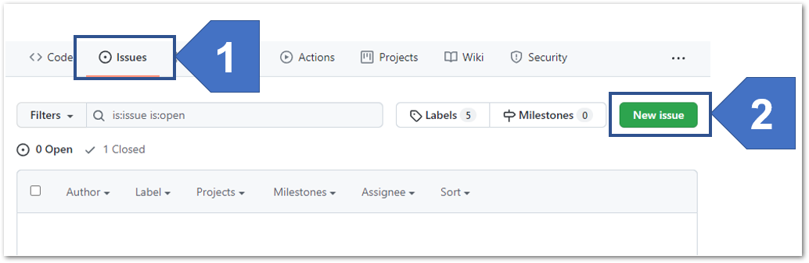
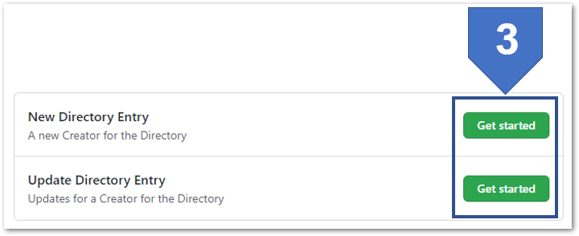
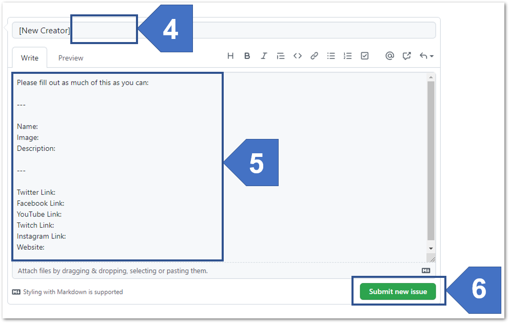

+++
title = "About"
description = "About Creators of Colour"
author = "Content Creators"
date = "2019-02-28"
layout = "about"
+++

This website is [intended](https://twitter.com/_JaneyLaney/status/1453992199885033475) to be a directory of Black and POC Minecrafters.

Who can be a Minecrafter? Someone who contributes to the Minecraft community in a positive and productive way. This includes:
- Artists 
- Content Creators (live stream and pre recorded)
- Map Makers
- Modders 
- Podcasters 
- Reddit contributers 
- Skin creators
- RP Voice Actors 

ALL of the Minecrafters featured in this directory are ACTIVE and have given us permission to be on this directory. 

## Criteria to Be Listed

*Information coming soon!*
## How do I get Listed?
To be added to the directory, you'll want to create a new Issue here:  
https://github.com/Crafting-With-Colour/crafting-with-colour/issues

On the GitHub site, in the **Issues** (1) section, you will need to create a **New Issue** (2).  

> Note: This will require you to create a free GitHub account if you do not already have one.

> *Image shows GitHub page excerpt.  A label #1 is pointing to the Issues section of the site.  Label #2 is pointing to the **New Issue** button.*

When you click the **New Issue** button, you'll be presented with a choice of issue templates.  At the time of this writing, you can choose between making a **New Directory Entry** or **Update Directory Entry** (for existing content that needs changing, such as a new link or photo).

Click on the **Get Started** button (3) for the Issue you want to make.

> *Image shows GitHub page excerpt.  Two options are shown in a list, "New Directory Entry" and "Update Directory Entry.  Each option has a **Get Started** button.  Label #3 is pointing to a rectangle that encloses the **Get Started** buttons.*

This will take you to a form to fill in with your details.  In our example below, we show a **New Creator** form, but the process is the same for both:

1. Enter a title, such as your name or channel name
2. Enter as much detail as you'd like to have included in your listing.  An example set of links is included in the template, but don't worry if you don't have links for that platform! Just leave those blank.
3. Click on the **Submit new issue** (6) button

> *Image shows GitHub page excerpt.  There is a single-line textbox with a label of #4 pointing to it. The textbox is partially filled in, in this case with "[New Creator]".  Label #5 points to a large textbox area with a pre-filled template of information to include. Template asks for Name, Image, Description, Twitter Link, Facebook Link, YouTube Link, Twitch Line, Instagram Link, and Website.  Label #6 points to a button named **Submit new issue***

When someone from the team has reviewed your Issue, they will either:
* Ask for more information, which will trigger an email to your GitHub account.
* "Close" the issue when the information you've submitted has been added to the Directory, which will also email you to let you know!

